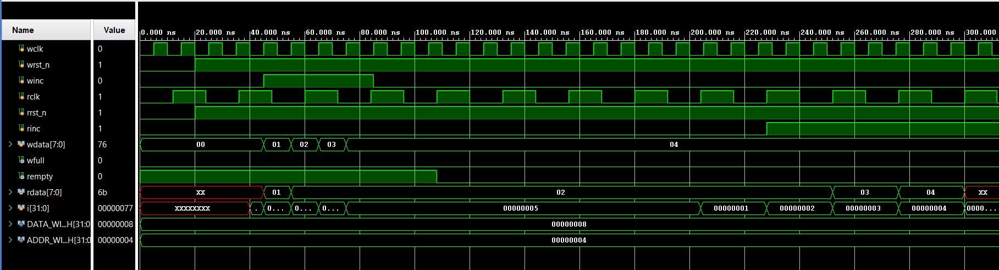
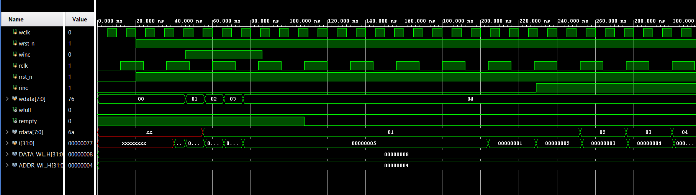
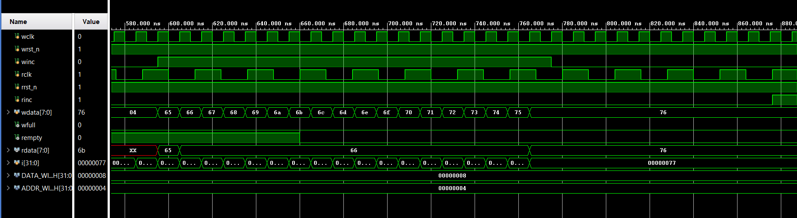
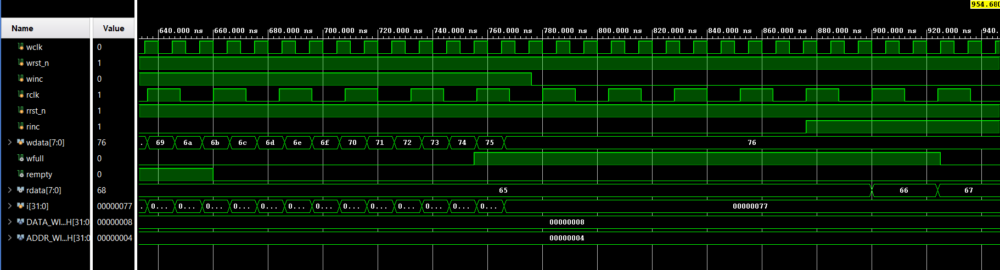
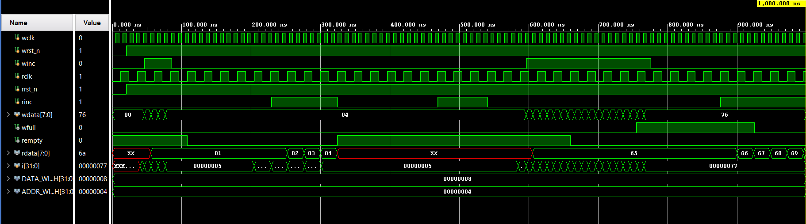

# Asynchronous FIFO with Clock Domain Crossing (CDC)

## Overview
This project is a multi-clock Asynchronous FIFO designed from scratch in Verilog. 

The goal of this project was to safely pass data between two completely independent hardware systems running at different clock speeds (a fast Write Domain and a slow Read Domain). To prevent data corruption and metastability, I implemented Clock Domain Crossing (CDC) using 2-stage synchronizer flip-flops and Gray code pointers.

## Why CDC? The Threat of Metastability
In digital hardware, every flip-flop is driven by a clock. For a flip-flop to safely capture a logical `1` or a `0`, the incoming data must remain completely stable for a tiny window of time right before the clock ticks (setup time) and right after (hold time).

Because an Asynchronous FIFO has two entirely independent clocks running at different frequencies, the Write Clock will inevitably tick at the *exact same fraction of a nanosecond* that the Read Clock ticks. If a signal tries to cross between domains at that exact moment, it violates the setup/hold time. 

When this happens, the receiving flip-flop gets confused and enters a state called **metastability**. Instead of cleanly snapping to a `1` or a `0`, its voltage gets stuck floating somewhere in the middle. It acts like a coin spinning on its edge. While it spins, it sends fluctuating, unpredictable garbage data to the rest of the chip, which can cause catastrophic system failure. 

To prevent this, this design uses **2-stage synchronizers** (`sync_r2w.v` and `sync_w2r.v`). These double flip-flop chains act as a hardware quarantine zone, giving the "spinning coin" enough time to settle to a valid, stable state before the rest of the factory is allowed to process the data.

## Architecture & Modules
The design is a highly parameterizable structural architecture (`DATA_WIDTH` and `ADDR_WIDTH`) consisting of five internal sub-modules. The system strictly isolates the Read and Write clock domains, using Clock Domain Crossing (CDC) techniques to ensure data integrity and prevent metastability.

1. **`async_fifo.v` (Top-Level Wrapper)** The structural top-level module that instantiates all sub-components. It routes the asynchronous clocks, resets, and internal data buses, acting as the physical boundary of the FIFO.

2. **`fifomem.v` (Dual-Port RAM)** The core memory array. The write path is strictly synchronous, guarded by a clock enable that checks both the external write increment request and the internal `wfull` flag to prevent data overwrites. The read path utilizes an unclocked, continuous assignment (combinational logic) to immediately reflect the data at the current read address.

3. **`sync_r2w.v` & `sync_w2r.v` (2-Stage Synchronizers)** These modules are the primary defense against metastability. They consist of double flip-flop synchronizer chains that safely pass the Gray code pointers across the asynchronous clock boundaries. 

4. **`wptr_full.v` (Write Domain Controller)** This module manages the Write Team's state. It increments the binary write pointer, translates it into Gray code to ensure only one bit toggles per clock cycle, and calculates the `wfull` (FIFO full) flag. The full condition is calculated by comparing the next Gray write pointer against the synchronized read pointer, specifically checking for an inverted MSB and inverted second-MSB to detect a full lap.

5. **`rptr_empty.v` (Read Domain Controller)** This module manages the Read Team's state. It increments the binary read pointer, translates it into Gray code, and calculates the `rempty` (FIFO empty) flag. The empty condition is calculated by checking for exact equality between the next Gray read pointer and the synchronized write pointer.

## Verification & My Debugging Journey
Writing the RTL was only half the project. To prove the hardware worked, I wrote a 3-phase, self-checking testbench (`tb_async_fifo.v`). I tested normal traffic, an underflow boundary (trying to read an empty FIFO), and an overflow stress test (trying to write 18 items into a 16-slot FIFO).

During the testbench creation and the overflow stress test, I ran into three major issues that I had to debug using waveform analysis.

### Bug 1: The Testbench Race Condition
When I first wrote my testbench, I noticed my first piece of data (`01`) was completely skipping the FIFO and disappearing. 

By looking at the waveform, I realized I had a simulation race condition. Because my testbench was updating the data exactly on the `posedge` of the clock, it was swapping out Box `01` for Box `02` at the exact same nanosecond the memory room was trying to grab it. 

**The Fix:** I added a tiny `#1` (1-nanosecond) delay after the clock edge in my testbench `for` loops. This perfectly mimicked a physical setup/hold time delay and allowed the memory to safely latch the data before the testbench changed it. 

*Before adding the delay (Notice `01` is completely skipped):*

*After adding the `#1` delay (Notice `01` is successfully captured):*

### Bug 2: The Gray Code Math Failure
With the testbench working, I ran my overflow stress test. I pushed 18 items into my 16-slot memory. I expected the `wfull` flag to shoot up to `1` at the 16th item, but in the waveform, it stayed totally flat at `0`.

**The Fix:** I looked at my `wptr_full.v` logic. To check if a Gray code pointer has done a full lap, you have to invert the top **two** MSB bits. I had only inverted the top single bit. I updated the code to `{~w2_rptr[ADDR_WIDTH], ~w2_rptr[ADDR_WIDTH-1]...}`, and the flag successfully triggered!

*The broken math logic (Notice `wfull` stays flat at 0 even though capacity is reached):*

### Bug 3: The Missing Memory Safeguard
When I re-simulated the Gray code bug, I noticed something horrifying. Even though the `wfull` flag was broken, the memory room shouldn't have overwritten my old data. But the waveform showed my original data getting crushed by the 17th and 18th writes. 

I realized my `fifomem.v` module was blindly trusting the outside world. If the external write-enable (`winc`) was high, it opened the doors, completely ignoring its own full state. 

**The Fix:** I had to add a hardware safeguard at the lowest level. I updated the memory's `always` block to explicitly check the full flag: `if (wclken && !wfull)`. 

Once both fixes were applied, the final waveform showed the FIFO perfectly locking its doors at capacity and protecting the data!

*The fixed architecture (Notice `wfull` goes high, and the original data is protected from being overwritten!):*

### The Final Verified System
After applying both patches, I ran the full 3-phase verification plan one last time. The waveform below shows the complete, zoomed-out simulation. The FIFO successfully handles normal traffic, safely ignores underflow read requests, and securely locks its memory doors during the overflow stress test. 

## How to Run
To run this simulation yourself:
1. Compile all `.v` files using your preferred simulator (Vivado, ModelSim, Icarus Verilog).
2. Run the simulation.
3. View the generated `fifo_waveform.vcd` file in GTKWave or your simulator's waveform viewer.